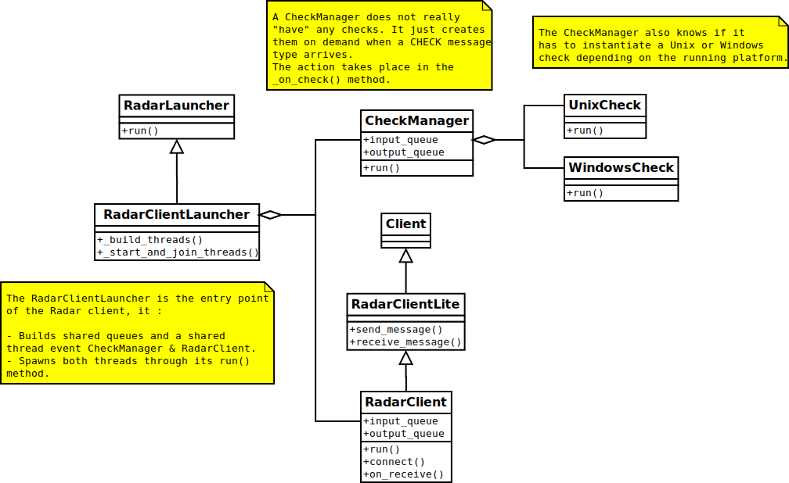
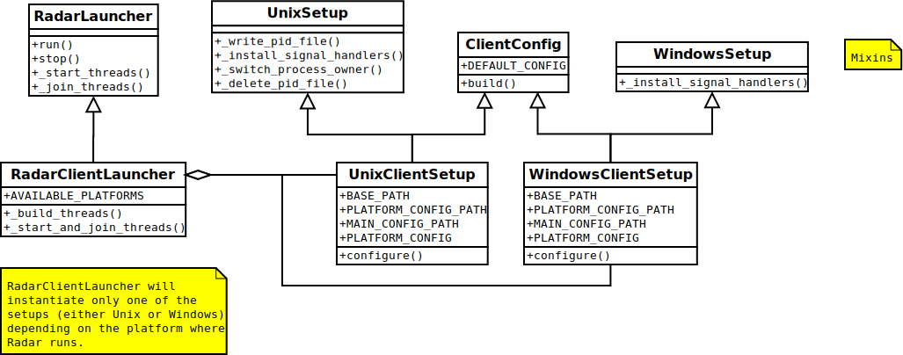
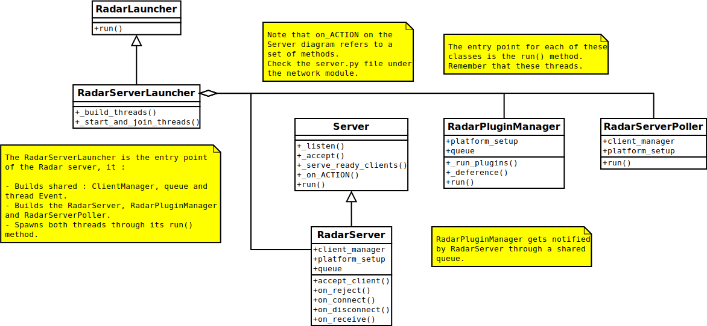
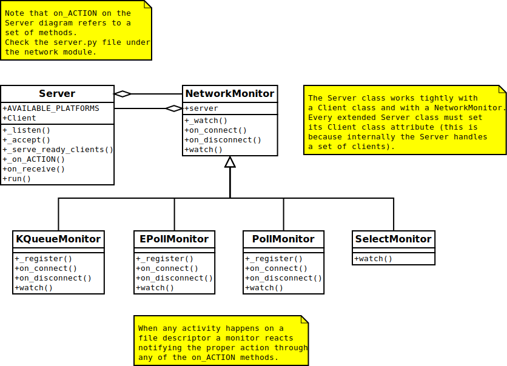
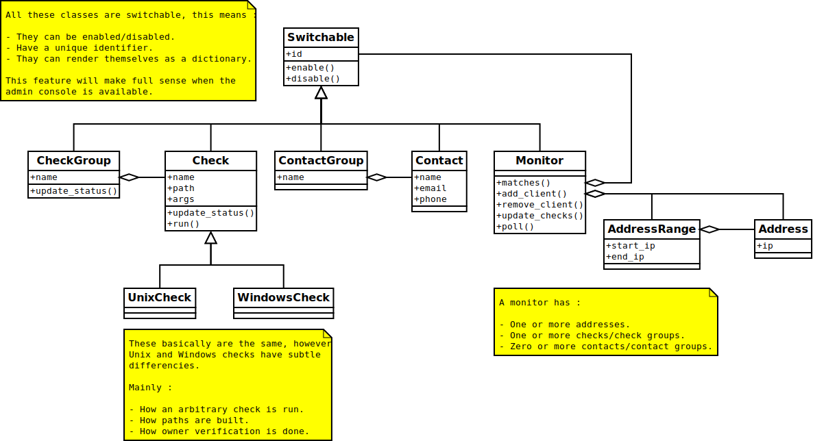
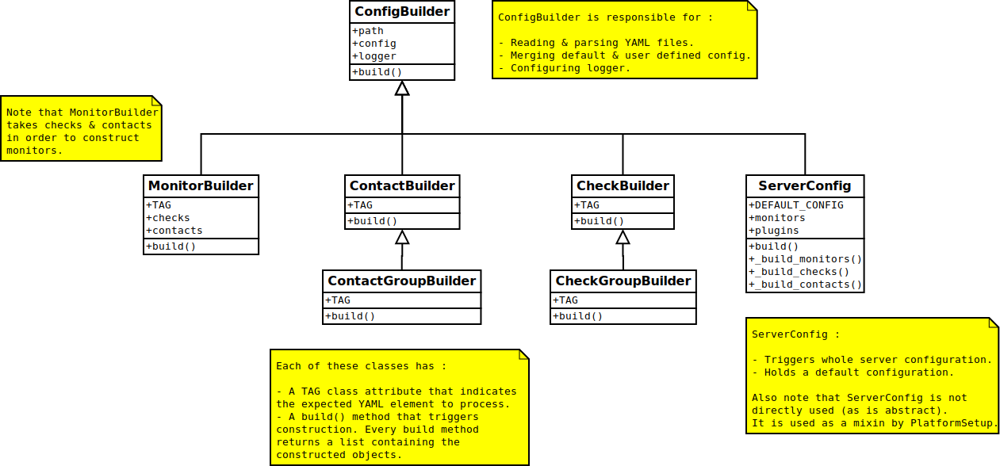

Radar internals
===============

Radar has been carefully designed to its keep base code clean and
understandable, so everyone can take a look at its internals (and hopefully
play with the code).

This section of the documentation tries to expose the main ideas that were
implemented to make this project possible. We'll not describe every single
detail because that would take a huge amount of time and you'll get bored.
Instead I've decided to describe few things as possible and try to reflect
why a decision was taken that way. Also consider that like everybody else, I make
mistakes and no perfect software design exists and Radar is a long way
from achieving that.

Overview
--------

Radar is designed to be a small tool, its core isn't intended to grow
indefinitely besides some currently lacking features. The reason behind
this is that a tool that is small and controlled in its size and its
objectives is easier to understand and does its work better than an
all-problem-solving solution.
This also has a downside : a small tool may not offer advanced or complex
features. Radar's main goal is to be a simple and easy to use tool hence the
reason why you might not find as many features as other solutions may offer.

Radar makes use of object oriented programming, every component is modeled
using a class. Some few classes make use of mixins and all errors are
handled through exceptions. Radar also makes heavy use of list comprehensions
across the project.

If you take a fast look to the code you'll realize that almost every method
is only a few lines long. Every class is intended to perform a specific task
and each method solves a concrete piece of that task.
The result is that you won't find complex or twisted code and reading any
piece of code and get the idea of what is doing should take little time.
The code mostly lacks comments, the reason for this is that the code
intends to be self-describing (care has been taken to make classes and
methods describe and reflect their intentions). Radar tries to stick to
this rule.

Project layout
--------------

Radar has the following project structure :

.. code-block:: bash

    /Radar
        /docs                # Includes project's documentation in reStructuredText.
                             # Sphinx is used for documentation generation.

        /scripts             # Launch scripts of Radar server and client.
                             # Configuration scripts for Radar server and client.

        /init_scripts        # Init scripts for different operating systems.
        /tests               # Project's tests.

        /radar
            /check           # Check and CheckGroup abstractions.
            /check_manager   # CheckManager governs check execution.
            /class_loader    # Loading mechanism for plugins.
            /client          # Main RadarClient abstraction.

            /client_manager  # ClientManager handles Radar clients when connect,
                             # disconnect and send replies.

            /config          # Includes builders that handle initializations of
                             # both Radar client and server.

            /contact         # Contact and ContactGroup abstractions.

            /initial_setup   # Includes facilities to configure Radar after
                             # it has been installed.

            /launcher        # Includes classes that fire up both Radar server
                             # and client.

            /logger          # Logging services.
            /misc            # A few helper classes mainly used by Radar server.
            /monitor         # Monitor abstraction.

            /network         # Low level network facilities to handle both 
                             # server and clients. Different platform specific
                             # network monitors are found here.

            /platform_setup  # Platform specific configuration and setup.

            /plugin          # Plugin and PluginManager classes work each other
                             # closely to allow plugin functionality.

            /protocol        # Low level network protocol that Radar uses for
                             # communicating between server and clients.
                             
            /server          # Main RadarServer abstraction.

Initialization
--------------

Both Radar client and server go through almost the same steps before going
into operational mode. When Radar (client or server) is fired up it 
instantiates a launcher (RadarClientLauncher for the client and
RadarServerLauncher for the server) and immediately calls its run() method.

From that point a three phase initialization takes place :

1. First the command line is processed. This is done in the RadarLauncher
   class. After this, objects and configurations are read from the main
   configuration file and alternate files in the case of the server are
   parsed and processed.
2. Client and server proceed to define, create and configure threads. 
3. Finally threads are launched.

After all threads are successfully launched client and server break away and
start performing completely different tasks.

Operational overview
--------------------

Both Radar client and server operate in an event triggered fashion and make
use of threads to distribute the workload.
If you look at the code of the RadarServer and RadarClient classes you'll
find methods called 'on_something'. Every time a network event occurs it is
reflected in any of those methods. The heart of Radar is two abstract
classes : Client and Server which can be found under the network module.
The Client and Server classes operate in a very similar way despite being
different from the way they handle network sockets.

The network module also provides some network monitors that are platform
dependent. Before Radar server goes into operational mode it tries to select
the best multiplex i/o method available. In any case if the platform can't
be detected or an efficient multiplexing method cannot be found Radar will
fall back to the SelectMonitor (which relies on the select system call).
The currently supported multiplexing strategies are : select, poll, epoll
and kqueue.

Radar's client and server also operate in a non-blocking way. Its main threads
loops are iterated constantly every 200 milliseconds. This prevents any
single client from blocking the server indefinitely due to a malformed or
incomplete network message. Also this mechanism is used as an easy workaround
to gracefully terminate threads : one thread Event is shared among all defined
threads, when this thread event is stopped the condition of the loop does
not hold and the threads successfully end.

Server operation
----------------

The main work of the server is split across three main threads :

* RadarServer.
* RadarServerPoller.
* PluginManager.

RadarServer :

This thread is responsible for accepting clients and receiving replies from
them. A client is only accepted if it is defined in at least one monitor
and is not duplicated (that is, if the same client isn't already connected).

Once a client is accepted it is registered within the ClientManager.
The ClientManager acts as proxy that talks directly to all defined monitors.
Every monitor internally knows if it has to accept a client when it connects,
if it is indeed accepted then a copy of the checks and contacts is stored
along with the instance of that client. This copy is needed because more than
one client may match against the same monitor.

The reverse process applies when a client disconnects, the RadarServer unregisters
that client and the connection is closed.

When a client sends a reply is it also initially processed by the ClientManager.
The reason for this is that we need to get a list of checks and contacts
that are affected by such reply. These two lists of objects are later on
transferred to the PluginManager to be processed by any defined plugins.

RadarServerPoller :

This is the simplest thread. Every N seconds it simply asks the ClientManager
to poll all of its monitors. The existence of this thread is that it makes
sense to have a different abstraction that decides when its time to poll
the clients. If this work would have been done in the RadarServer we would
be mixing asynchronous (network activity) and synchronous (wait a certain amount
of time) events making the overall design more complex to both understand
and work with.

PluginManager :

As its name indicates, this is the place where all plugins are executed and
controlled. Whenever the RadarServer receives a reply from a client and after
little processing a dictionary containing all relevant plugin data is written
by the RadarServer to a  queue that both RadarServer and PluginManager share,
this is the mechanism of communication between those objects.
The PluginManager quietly waits for a new dictionary to arrive from this
queue, when it does it disassembles all parameters and performs object id
dereferencing of two lists that contain the affected checks and the
related contacts. This dereferencing is possible because threads share the
same address space. This solution seems more elegant and effective than
re-instantiating those objects from their states.
After this pre-processing every plugin's run method is called with appropiate
arguments. If a plugin does not work properly all exceptions are caught and
registered in the Radar's log file.

Client operation
----------------

The client relies on two threads :

* RadarClient.
* CheckManager.

RadarClient :

This thread is responsible for receiving and replying messages from the
Radar server. For every message received the message is desearialized and
written to a queue (that is shared with the CheckManager). Both RadarClient
and CheckManager actually share two queues to support bidirectional
communication between threads. One queue is used to write checks that need
to be executed, the other is used to read the results of those executions.

In case the Radar client is unable to connect to the Radar server it will
wait a certain amount of time and try to reconnect again. This is repeated
indefinitely if the reconnect option is set to True. It will try to connect
after 5, 15 and 60 seconds (cyclically). This option is useful because after
updating the Radar's server configuration you need to restart it and all
connections are lost. Radar currently does not provide a reload mechanism.

CheckManager :

Whenever a CHECK message is received by the RadarClient thread and after
little processing is immediately sent to the CheckManager. When the check
information is received the CheckManager proceeds to instantiate a bunch
of Checks (depending on the platform running it may instantiate a UnixCheck
or a WindowsCheck) and finally executes them sequentially.
Every check's output is collected and verified (the CheckManager makes sure
that the Check didn't blow up and that a valid status was returned). It also
discards all fields that are not relevant (it will only keep the status,
details and data fields of the returned JSON).

Once the outputs have been collected they're sent back to the RadarClient
through the other queue and RadarClient sends those results back to the
RadarServer.

Network protocol
----------------

Radar client and server use TCP for all of its communications. Here is the 
network protocol that is used by Radar :

    +------+---------+--------------+---------+
    | TYPE | OPTIONS | PAYLOAD SIZE | PAYLOAD |
    +------+---------+--------------+---------+

* TYPE (1 byte) : Current message types are TEST, TEST REPLY, CHECK
  and CHECK REPLY.

* OPTIONS (1 byte) : Current options are NONE and COMPRESS. 

* PAYLOAD SIZE (2 bytes) : Indicates the size (in bytes) of the payload.

* PAYLOAD (variable) : N bytes make up the payload. The payload's maximum
  size is 64 KiB.

Every time the poller needs to query its clients a CHECK message is built
and broadcasted to all clients that are managed by any monitor. When
the client receives this CHECK message it proceeds to run all checks that
the server instructs it to run. After all checks are executed their outputs
are collected and a CHECK REPLY message is built and sent to the server.

The TEST and TEST REPLY messages are not yet implemented (just defined). The
idea is to have a user-controlled way to explicitly force the run of specific
checks. This is useful because if a check is not working as expected and
a developer or sysadmin fixes it, then it doesn't not make sense to wait until
the next poll round to verify that check performs as expected or fails again.
This feature will be implemented in a next release along with a small console
that allows the user to have more control of the running server.

The payload is always a JSON. The decision behind using JSON is that
provides flexibility and an easy way to validate and convert data that
comes from the other side of the network. Besides that it also allows the
final user to layout the data field of checks as she or he wishes.
This also has downsides : more bytes are sent through the network and an
extra overhead is payed every time we serialize and deserialize a JSON
string.

Currently messages are not being compressed at all. This feature makes
sense only if the client replies a message longer than 64 KiB. This feature
will be certainly included in a future release.

Class diagrams
--------------

Sometimes class diagrams help you see the big picture of a design and also
act as useful documentation. Here are some diagrams that may help you to
to understand what words make cumbersome to describe.

The diagrams contain the most relevant classes of both Radar server and client.
Only the most important methods of every class are mentioned.
You should follow these diagrams along with the code to have a detailed
understanding about what's happening on a certain part of the project.

Radar client :

    +----------------+-------------------------+
    |  RadarClient   | RadarClientLauncher     |
    +================+=========================+
    | |radar-client| | |radar-client-launcher| |
    +----------------+-------------------------+

Radar server :

    +----------------+----------+
    | RadarServer    | Server   |
    +================+==========+
    | |radar-server| | |server| |
    +----------------+----------+

| 

    +-----------+-----------------+
    | Monitor   | ServerConfig    |
    +===========+=================+
    | |monitor| | |server-config| |
    +-----------+-----------------+

Notes :

 * RadarServerLauncher is analogous to RadarClientLauncher.

.. Radar client class-diagrams.

.. Radar server class-diagrams.

