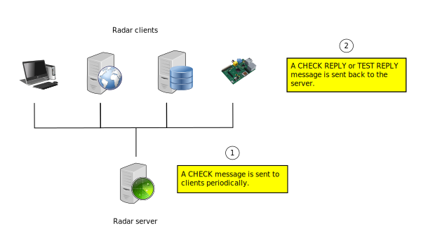

Overview
========

Radar is a monitoring tool that tries to make things simple and easy. Radar
is not an advanced monitoring tool and you may not find all features that
you may find in other monitoring solutions because Radar's philosophy relies
heavily on these two ideas :

* Simplicity : Both user-interface and source code are intended to be
  as simple and clean as possible. The code isn't designed to grow
  indefinetly mainly because by limiting its scope, its behaviour can be
  better controlled, tested and understood. The code is designed to be
  understood by anyone who has some Python and OOP knowledge.
  Its main ideas are described later in the internals section of this
  document.

* Extendability : As you will see later Radar is not focused on any
  particular resource monitoring. Instead it allows you to integrate any
  custom designed checks to verify any resource that you want.
  This does not only applies to IT infratructure, you could for example
  read data from a sensor that is attached to a PC or device that is
  capable of running the Python interpreter.

Once you get the Radar server up and running any number of clients may connect
and after a user-defined interval they will be constantly polled.
The following diagram shows the big picture how Radar operates :

So what can you really do with Radar ? Here are some ideas :

* Notifications : This is a typical use. Notify any of your defined contacts
  if something is not performing as expected. You can notify by email, sms
  or maybe put data in a queue and have another process take that responsibility.
  You could also notify through a real time messaging system like `XMPP <https://en.wikipedia.org/wiki/XMPP>`_.

* Graphing tool : Each time you receive data from a check you can add that
  information to a database (like `RRDtool <http://www.rrdtool.org>`_) and then generate graphs.
  You can get this way trends of your resources.

* Take an advanced action : Suppose that you run a cluster of servers on
  a cloud-based provider. Then by inspecting the replies of your checks,
  you can write a plugin to add/remove servers on demand, if you get for
  example that the amount of requests/sec. that a server is processing
  are exceeded.

Any of these ideas requires that you write a plugin for it, Radar does not
include any built-in functionality and these tasks are delegated to plugins.
You can take a look at how to develop checks and plugins on the following
sections of this document. Don't panic ! A lot of effort has been put to make
these tasks as simple as possible, so keep reading the docs.
